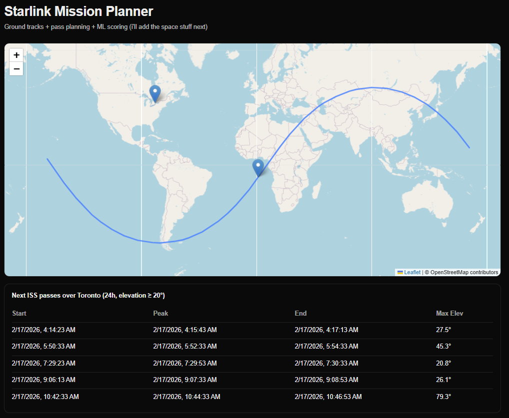

# Starlink Mission Planner

Interactive satellite mission-planning app that fetches public TLE orbit data, visualizes the ISS ground track in real time, and predicts upcoming overhead passes for Toronto.

## Demo (work in progress)
 

## What it does (so far)
- **Live-ish orbital data ingest:** Server route fetches + caches TLEs (Starlink + stations/ISS) from CelesTrak.
- **Map visualization:** Leaflet map with **Toronto** as the default observer, plus **ISS ground track** (polyline) and **current position** marker.
- **Pass prediction:** `/api/passes` computes upcoming ISS passes over Toronto (start/peak/end + max elevation) and the UI displays them in a table.

## Tech stack
- Next.js (App Router) + TypeScript
- Leaflet + react-leaflet
- satellite.js (SGP4 propagation)

## Getting started

### Install
```bash
npm install
npm i leaflet react-leaflet satellite.js
npm i -D @types/leaflet
```
### Run
```bash
npm run dev
```
